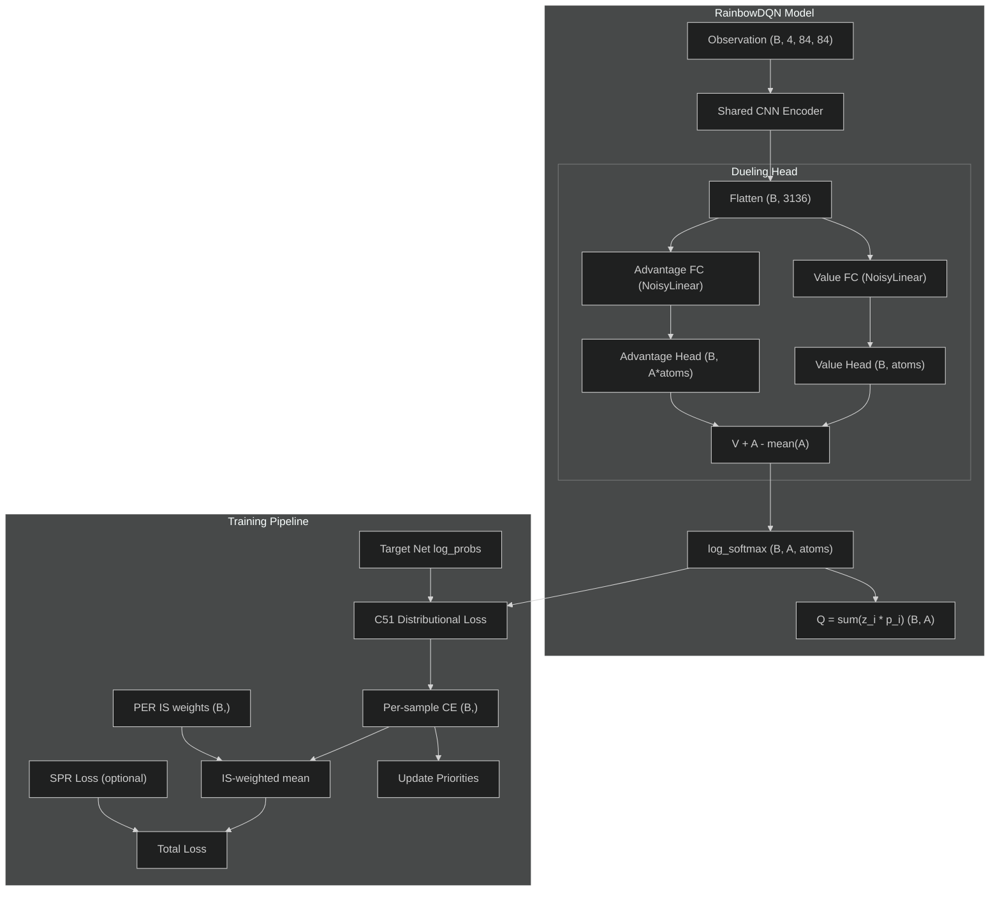

# Rainbow Architecture

> **Quick links:** [DQN Model](dqn-model.md) . [SPR Architecture](spr-architecture.md) . [DQN Training](dqn-training.md) . [Config Reference](config-cli.md)

<br><br>

## Overview

Rainbow DQN (Hessel et al. 2018) combines six independent improvements
to DQN into a single agent. This implementation includes all six
components: C51 distributional RL, Double DQN, dueling architecture,
NoisyNet exploration, prioritized experience replay, and multi-step
returns.

When `rainbow.enabled=true`, the training loop switches from scalar
TD targets and MSE/Huber loss to distributional targets and
cross-entropy loss, replaces epsilon-greedy with NoisyNet exploration,
and uses prioritized replay with importance sampling correction.

**Source files:**

| File | Contents |
|------|----------|
| `src/models/rainbow.py` | `RainbowDQN` model (dueling + distributional + noisy) |
| `src/models/noisy_linear.py` | `NoisyLinear` factorised Gaussian noise layer |
| `src/training/distributional.py` | `compute_distributional_loss()` (C51 projection) |
| `src/replay/prioritized_buffer.py` | `PrioritizedReplayBuffer` with sum-tree |
| `src/replay/sum_tree.py` | `SumTree` for O(log N) priority sampling |
| `src/training/metrics.py` | `perform_rainbow_update_step()` |
| `src/training/optimization.py` | `RAINBOW_OPTIMIZER_DEFAULTS` |
| `src/training/target_network.py` | `init_target_network()` (introspection-based) |

**References:**

- Hessel et al. 2018, "Rainbow: Combining Improvements in Deep
  Reinforcement Learning" (AAAI 2018)
- Bellemare et al. 2017, "A Distributional Perspective on
  Reinforcement Learning" (C51)
- Wang et al. 2016, "Dueling Network Architectures for Deep
  Reinforcement Learning"
- Fortunato et al. 2018, "Noisy Networks for Exploration"
- Schaul et al. 2016, "Prioritized Experience Replay"

<br><br>

## Component Diagram

<div align="center">



</div>

**Figure 1:** Rainbow training data flow. The RainbowDQN model outputs
distributional log-probabilities over support atoms. The training
pipeline computes C51 cross-entropy loss, applies IS weights from
prioritized replay, optionally adds SPR auxiliary loss, and updates
sum-tree priorities using per-sample losses.

<br><br>

## RainbowDQN Model

### Constructor

```python
RainbowDQN(
    num_actions: int,
    num_atoms: int = 51,
    v_min: float = -10.0,
    v_max: float = 10.0,
    noisy: bool = True,
    dueling: bool = True,
    dropout: float = 0.0,
)
```

### Architecture

```text
Input:  (B, 4, 84, 84)   float32 [0, 1]
   |
Conv1:  in=4, out=32, kernel=8x8, stride=4  -> ReLU
Output: (B, 32, 20, 20)
   |
Conv2:  in=32, out=64, kernel=4x4, stride=2 -> ReLU
Output: (B, 64, 9, 9)
   |
Conv3:  in=64, out=64, kernel=3x3, stride=1 -> ReLU
Output: (B, 64, 7, 7)     <- conv_output (for SPR)
   |
Flatten: (B, 3136)

[Dueling path]
   |
   +-- Value stream:  NoisyLinear(3136, 512) -> ReLU -> Dropout
   |                  NoisyLinear(512, num_atoms)
   |                  Output: (B, num_atoms)
   |
   +-- Advantage stream: NoisyLinear(3136, 512) -> ReLU -> Dropout
                         NoisyLinear(512, num_atoms * num_actions)
                         Output: (B, num_actions, num_atoms)

Aggregation: Q_atoms = V + A - mean(A)    (Wang et al. 2016, Eq. 9)
             Shape: (B, num_actions, num_atoms)

log_probs = log_softmax(Q_atoms, dim=2)   (B, A, atoms)
probs     = softmax(Q_atoms, dim=2)       (B, A, atoms)
q_values  = sum(probs * support, dim=2)   (B, A)
```

### Forward Output

The `forward()` method returns a dict:

| Key | Shape | Description |
|-----|-------|-------------|
| `q_values` | `(B, num_actions)` | Expected Q-values: `sum(z_i * p_i)` |
| `log_probs` | `(B, num_actions, num_atoms)` | Log-softmax over atoms per action |
| `conv_output` | `(B, 64, 7, 7)` | Spatial features for SPR |

### Support Atoms

The C51 support is a fixed set of atoms spanning the value range:

```text
support = linspace(v_min, v_max, num_atoms)    # (51,)
delta_z = (v_max - v_min) / (num_atoms - 1)   # 0.4 for [-10, 10]
```

Stored as a buffer on the model: `self.support`.

<br><br>

## NoisyLinear

Factorised Gaussian noise replaces epsilon-greedy exploration.
Each forward pass samples new noise, making action selection
inherently stochastic during training.

### Parameters and Buffers

| Name | Shape | Type | Description |
|------|-------|------|-------------|
| `weight_mu` | `(out, in)` | Parameter | Learnable mean weights |
| `weight_sigma` | `(out, in)` | Parameter | Learnable noise scale |
| `bias_mu` | `(out,)` | Parameter | Learnable mean bias |
| `bias_sigma` | `(out,)` | Parameter | Learnable noise scale |
| `eps_in` | `(in,)` | Buffer | Input noise vector |
| `eps_out` | `(out,)` | Buffer | Output noise vector |

### Noise Generation (Factorised)

```text
f(x) = sgn(x) * sqrt(|x|)

eps_weight = f(eps_out) outer f(eps_in)    # (out, in)
eps_bias   = f(eps_out)                    # (out,)
```

### Forward Pass

```text
Training:  y = (mu_w + sigma_w * eps_w) * x + (mu_b + sigma_b * eps_b)
Eval:      y = mu_w * x + mu_b    (deterministic, mean only)
```

### Initialization

From Fortunato et al. 2018, Section 3.2:

```text
mu bound    = 1 / sqrt(in_features)
sigma_init  = sigma_0 / sqrt(in_features)    # sigma_0 = 0.5
```

Sigma parameters are `nn.Parameter`, so they are captured automatically
in `model.state_dict()` and do not need separate checkpoint handling.

**Location:** `src/models/noisy_linear.py`

<br><br>

## Distributional Loss (C51 Projection)

Implements Algorithm 1 from Bellemare et al. 2017.

### Function Signature

```python
compute_distributional_loss(
    online_log_probs: Tensor,    # (B, A, atoms) with gradients
    actions: Tensor,             # (B,) int64
    rewards: Tensor,             # (B,) float32
    dones: Tensor,               # (B,) bool
    target_log_probs: Tensor,    # (B, A, atoms) detached
    next_actions: Tensor,        # (B,) int64
    support: Tensor,             # (num_atoms,)
    gamma: float,
) -> Dict[str, Tensor]
```

### Returns

| Key | Shape | Description |
|-----|-------|-------------|
| `loss` | scalar | Mean cross-entropy (with gradients) |
| `per_sample_loss` | `(B,)` | Per-sample CE for IS weighting and priorities |

### Algorithm

1. **Select distributions:** Gather online log-probs for taken actions
   and target probs for best next actions.

2. **Project target onto fixed support:**
   ```text
   Tz_j = clamp(r + gamma * (1 - done) * z_j, v_min, v_max)
   b_j  = (Tz_j - v_min) / delta_z
   l, u = floor(b_j), ceil(b_j)
   ```

3. **Scatter probabilities to neighbors:**
   ```text
   projected[l] += target_prob * (u - b_j)
   projected[u] += target_prob * (b_j - l)
   ```

4. **Cross-entropy loss:**
   ```text
   L_i = -sum_j projected_j * log(online_prob_j(action_i))
   ```

**Location:** `src/training/distributional.py`

<br><br>

## Prioritized Experience Replay

### PrioritizedReplayBuffer

Extends `ReplayBuffer` with sum-tree-based proportional prioritization
and importance sampling weight correction.

```python
PrioritizedReplayBuffer(
    capacity=1_000_000,
    obs_shape=(4, 84, 84),
    min_size=50_000,
    alpha=0.5,           # Priority exponent (0 = uniform)
    beta_start=0.4,      # IS correction start
    beta_end=1.0,        # IS correction end
    beta_frames=100_000, # Linear annealing frames
    epsilon=1e-6,        # Prevents zero probability
    n_step=1,            # Multi-step returns
    gamma=0.99,          # Discount for n-step
)
```

### Sample Output

The `sample()` method returns the standard replay keys plus PER-specific
keys:

| Key | Shape | Description |
|-----|-------|-------------|
| `states` | `(B, 4, 84, 84)` | Float32 observations in [0, 1] |
| `actions` | `(B,)` | Int64 action indices |
| `rewards` | `(B,)` | Float32 rewards |
| `next_states` | `(B, 4, 84, 84)` | Float32 next observations |
| `dones` | `(B,)` | Bool termination flags |
| `indices` | `(B,)` | Int64 buffer indices for priority update |
| `weights` | `(B,)` | Float32 IS weights |

### Priority Update Flow

```text
1. New transition stored with max_priority
2. Training step computes per-sample C51 cross-entropy loss
3. buffer.update_priorities(indices, per_sample_losses)
4. Stored priority: (|loss| + epsilon)^alpha
5. Sampling probability: P(i) = p_i / sum(p_k)
6. IS weight: w_i = (N * P(i))^{-beta} / max(w)
7. Beta anneals linearly from beta_start to beta_end
```

### SumTree

Array-based binary tree for O(log N) priority sampling:

```text
Index 0: unused
Index 1: root (total sum)
Indices [1, capacity): internal nodes
Indices [capacity, 2*capacity): leaf nodes (priorities)
```

- `update(leaf_idx, priority)`: O(log N) propagation to root
- `batch_sample(batch_size)`: Stratified sampling via equal segments
- `total`: Sum of all priorities (root value)

**Location:** `src/replay/sum_tree.py`, `src/replay/prioritized_buffer.py`

<br><br>

## Training Step Pipeline

`perform_rainbow_update_step()` executes the full Rainbow training
update. The 10-step pipeline:

```text
 1. Set training mode on online net (and SPR components if enabled)
 2. Reset noise on online and target nets (NoisyNet)
 3. Online forward pass: states -> log_probs (B, A, atoms)
 4. Target forward pass (no grad): next_states -> log_probs (B, A, atoms)
 5. Select next actions (Double DQN: online selects, target evaluates)
 6. C51 distributional loss -> per_sample_loss (B,)
 7. Apply IS weights: weighted_loss = mean(is_weights * per_sample_loss)
 8. Compute SPR loss (if enabled) and combine:
    total = weighted_loss + spr_weight * spr_loss
 9. Backward, clip gradients (max_norm=10.0), optimizer step
10. Update priorities in buffer; update EMA encoder (if SPR)
```

### Function Signature

```python
perform_rainbow_update_step(
    online_net,              # RainbowDQN
    target_net,              # RainbowDQN (frozen)
    optimizer,               # Adam (Rainbow defaults)
    batch,                   # Dict from PrioritizedReplayBuffer.sample()
    support,                 # (num_atoms,) from online_net.support
    gamma=0.99,
    n_step=1,                # Effective discount: gamma^n_step
    max_grad_norm=10.0,
    update_count=0,
    double_dqn=True,
    buffer=None,             # PrioritizedReplayBuffer for priority updates
    spr_components=None,     # Optional SPR modules dict
    spr_batch=None,          # Optional SPR sequence batch
    spr_weight=2.0,          # Lambda for SPR loss
) -> UpdateMetrics
```

### Returned Metrics

| Metric | Type | Description |
|--------|------|-------------|
| `loss` | `float` | Total loss (IS-weighted distributional + SPR) |
| `td_error` | `float` | Mean unweighted C51 cross-entropy |
| `td_error_std` | `float` | Std of per-sample cross-entropy |
| `grad_norm` | `float` | Gradient norm before clipping |
| `learning_rate` | `float` | Current optimizer learning rate |
| `distributional_loss` | `float` | C51 loss before IS weighting |
| `mean_is_weight` | `float` | Mean IS weight from PER batch |
| `mean_priority` | `float` | Mean priority in sum-tree |
| `priority_entropy` | `float` | Entropy of priority distribution |
| `beta` | `float` | Current IS correction exponent |
| `spr_loss` | `float` | SPR auxiliary loss (None if disabled) |
| `cosine_similarity` | `float` | Mean cos-sim (None if disabled) |

**Location:** `src/training/metrics.py`

<br><br>

## SPR Interaction

When both `rainbow.enabled=true` and `spr.enabled=true`, the
training step combines distributional C51 loss with SPR auxiliary loss:

```text
total_loss = IS_weighted_distributional + spr_weight * spr_loss
```

The SPR pipeline is identical to the vanilla DQN+SPR path:

1. Online encoder produces `conv_output` (64x7x7) -- shared between
   Q-learning and SPR
2. Transition model predicts K future latent states
3. Projection and prediction heads map to representation space
4. EMA encoder/projection provide gradient-free targets
5. Loss is negative cosine similarity with episode boundary masking

The key difference is step 7 in the training pipeline: the base TD
loss is IS-weighted distributional cross-entropy rather than scalar
MSE/Huber. Both loss components share a single backward pass and
optimizer step.

SPR components (transition model, projection, prediction heads) are
included in the optimizer's parameter groups alongside the RainbowDQN
parameters.

<br><br>

## Config Options

### Rainbow Section

```yaml
rainbow:
  enabled: false              # Master switch
  double_dqn: true            # Online net selects actions (van Hasselt 2016)
  dueling: true               # Separate value/advantage streams
  noisy_nets: true            # NoisyLinear replaces epsilon-greedy

  distributional:
    num_atoms: 51             # C51 support atoms
    v_min: -10.0              # Minimum support value
    v_max: 10.0               # Maximum support value

  multi_step:
    n: 3                      # N-step return horizon

  priority:
    alpha: 0.5                # Priority exponent
    beta_start: 0.4           # IS correction start
    beta_end: 1.0             # IS correction end (annealed linearly)
    epsilon: 0.000001         # Constant added to prevent zero priority
```

### Related Sections

SPR and EMA sections interact with Rainbow when both are enabled:

```yaml
spr:
  enabled: false
  prediction_steps: 5
  loss_weight: 2.0

ema:
  momentum: 0.99              # 0.0 with augmentation
```

**Location:** `experiments/dqn_atari/configs/base.yaml`

<br><br>

## Hyperparameter Comparison: DQN vs Rainbow

| Hyperparameter | Vanilla DQN | Rainbow |
|----------------|-------------|---------|
| Optimizer | RMSProp | Adam |
| Learning rate | `2.5e-4` | `6.25e-5` |
| Optimizer eps | `1e-2` | `1.5e-4` |
| Exploration | Epsilon-greedy (1.0 -> 0.1) | NoisyNet (sigma_0=0.5) |
| Loss function | MSE or Huber | C51 cross-entropy |
| Q-values | Scalar | Distributional (51 atoms) |
| Replay sampling | Uniform | Proportional priority (alpha=0.5) |
| IS correction | None | Beta annealing (0.4 -> 1.0) |
| Multi-step returns | n=1 | n=3 |
| Network head | Single linear | Dueling (value + advantage) |
| FC layers | `nn.Linear` | `NoisyLinear` |
| Target update | Hard copy every 10K steps | Hard copy every 8K steps |
| Replay warmup | 50K steps | 20K steps |
| Conv encoder | Nature CNN (3 layers) | Nature CNN (3 layers, same) |
| Conv output | `(64, 7, 7)` | `(64, 7, 7)` (same, SPR compatible) |

Rainbow optimizer defaults are defined in
`src/training/optimization.py:RAINBOW_OPTIMIZER_DEFAULTS`.

<br><br>

## Checkpoint Handling

When `rainbow_enabled=True`, `CheckpointManager.save_checkpoint()`
stores sum-tree priority state alongside standard checkpoint data:

```text
checkpoint["rainbow_state"] = {
    "priority_state": {
        "tree_data": np.ndarray,     # Full sum-tree array
        "max_priority": float,       # Current max priority
        "count": int,                # Number of entries written
    }
}
```

On resume, `buffer.set_priority_state()` restores the tree so
priority-weighted sampling continues from where training left off.

NoisyLinear sigma parameters are `nn.Parameter` objects, so they are
saved and restored automatically via `model.state_dict()`. IS beta is
deterministic from the frame count (already saved as `step`), so no
additional beta state is needed.

When `rainbow_enabled=False`, no `rainbow_state` key exists in the
checkpoint. Loading a non-Rainbow checkpoint returns
`rainbow_restored=False` in the result dict.

<br><br>

## Target Network Factory

`init_target_network()` uses `inspect.signature` introspection to
construct target networks from any model class:

```text
1. Inspect __init__ signature of online_net's class
2. For each parameter:
   - 'num_actions': use provided value
   - hasattr(online_net, name): use getattr(online_net, name)
   - has default in signature: use default
   - else: raise ValueError
3. Construct target with inferred kwargs
4. Copy weights via load_state_dict
5. Freeze all parameters (requires_grad=False)
6. Set eval mode
```

This handles both `DQN` and `RainbowDQN` without model-specific code.
For `RainbowDQN`, it automatically discovers `num_atoms`, `v_min`,
`v_max`, `noisy`, `dueling`, and `dropout` from the online network's
attributes.

**Location:** `src/training/target_network.py`

<br><br>

## Testing

Run Rainbow-specific tests:

```bash
# Model tests (shapes, outputs, components)
pytest tests/test_rainbow_model.py -v

# Training update step tests
pytest tests/test_rainbow_update.py -v

# Integration tests (full pipeline)
pytest tests/test_rainbow_integration.py -v

# Backward compatibility (no regressions)
pytest tests/test_rainbow_backward_compat.py -v

# Checkpoint save/load
pytest tests/test_checkpoint.py::TestRainbowCheckpoint -v

# Priority buffer
pytest tests/test_prioritized_buffer.py -v
```
