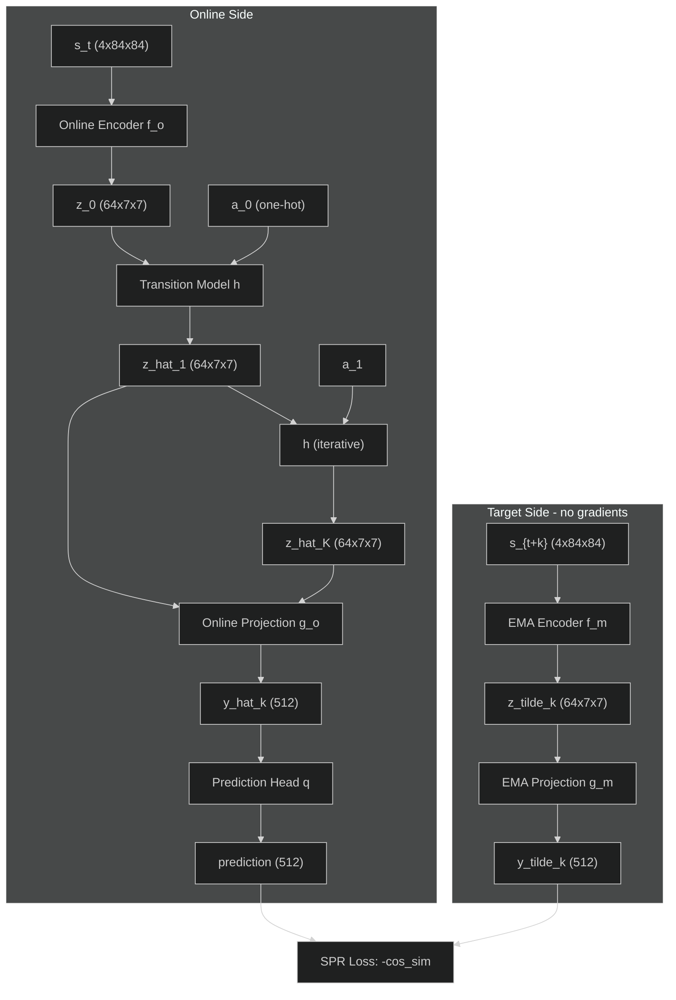

# SPR Architecture

> **Quick links:** [DQN Model](dqn-model.md) . [DQN Training](dqn-training.md) . [Training Loop](training-loop-runtime.md)

<br><br>

## Overview

Self-Predictive Representations (SPR) adds a self-supervised auxiliary
objective to DQN. The agent learns to predict its own future latent
representations using an action-conditioned transition model. Targets
come from an EMA (exponential moving average) encoder, not the online
encoder, which prevents representational collapse.

This document covers the architecture as implemented in this codebase
-- vanilla DQN as the base agent, not Rainbow (as in the original
paper).

**Source files:**

| File | Contents |
|------|----------|
| `src/models/spr.py` | `TransitionModel`, `ProjectionHead`, `PredictionHead` |
| `src/models/ema.py` | `EMAEncoder` |
| `src/models/dqn.py` | `DQN` (encoder, modified to expose `conv_output`) |
| `src/training/spr_loss.py` | `compute_spr_loss()` |
| `tests/test_spr_components.py` | Unit tests for all components |

**Reference:** Schwarzer et al., "Data-Efficient Reinforcement Learning
with Self-Predictive Representations," ICLR 2021.

<br><br>

## Component Diagram

<div align="center">



</div>

**Figure 1:** SPR data flow. The online side (left) predicts future
latent states through the transition model and maps them through
projection + prediction heads. The target side (right) encodes actual
future states through the EMA encoder and projection. The SPR loss
aligns predicted and target representations via cosine similarity.

<br><br>

## Tensor Shapes at Each Stage

```text
Input observation:        (B, 4, 84, 84)     4 stacked grayscale frames
                             |
                     [DQN Encoder f_o]
                             |
                     +-------+-------+
                     |               |
              conv_output        features
            (B, 64, 7, 7)      (B, 512)       512-dim FC output
                     |               |
                     |          [Q-head]
                     |               |
                     |          q_values
                     |        (B, num_actions)
                     |
        +------------+------------+
        |                         |
  [Transition Model h]    [Projection g_o]
  + action (B,) one-hot    flatten + FC
  input: (B, 64+A, 7, 7)       |
  output: (B, 64, 7, 7)   (B, 512)
        |                      |
  (applied K times)      [Prediction q]
        |                  Linear(512, 512)
   z_hat_k                     |
  (B, 64, 7, 7)          prediction
        |                 (B, 512)
  [Projection g_o]             |
        |                      v
   (B, 512)              [SPR Loss]
        |               -cos_sim with
  [Prediction q]        target (B, 512)
        |
   (B, 512) -----> [SPR Loss]
```

### Shape summary table

| Tensor | Shape | Description |
|--------|-------|-------------|
| `conv_output` | `(B, 64, 7, 7)` | Nature CNN conv3 output (pre-flatten) |
| `features` | `(B, 512)` | FC layer output (post-flatten, post-ReLU) |
| `action_onehot` | `(B, A, 7, 7)` | One-hot action broadcast to spatial dims |
| `transition_input` | `(B, 64+A, 7, 7)` | Conv output + action concatenated |
| `z_hat_k` | `(B, 64, 7, 7)` | Predicted latent at step k |
| `projection` | `(B, 512)` | Projected representation |
| `prediction` | `(B, 512)` | Predicted target representation |
| `target` | `(B, 512)` | EMA target representation (detached) |

<br><br>

## Component Details

### Transition Model

Two convolutional layers that predict the next latent state given the
current state and an action.

```text
Input: (B, 64 + num_actions, 7, 7)
  Conv1(64, 3x3, pad=1) -> BatchNorm2d -> ReLU
  Conv2(64, 3x3, pad=1) -> ReLU
Output: (B, 64, 7, 7)
```

Action conditioning: the action is one-hot encoded, broadcast to every
spatial position `(B, A, 7, 7)`, and concatenated along the channel
dimension. This preserves spatial structure -- each location sees the
same action signal.

The model is applied iteratively for K steps:

```python
z_hat = z_0  # initial conv output from encoder
for k in range(K):
    z_hat = transition_model(z_hat, actions[k])
```

**Location:** `src/models/spr.py:TransitionModel`

### Projection Head

Flattens the `(64, 7, 7)` spatial features and projects to `512`
dimensions with ReLU. Mirrors the FC layer of the DQN encoder.

```text
Input: (B, 64, 7, 7)
  Flatten -> (B, 3136)
  Linear(3136, 512) -> ReLU
Output: (B, 512)
```

Both online (`g_o`) and target (`g_m`) projections use this
architecture. The target projection is an EMA copy of the online
projection.

**Location:** `src/models/spr.py:ProjectionHead`

### Prediction Head

Single linear layer on the online side only. This asymmetry
(prediction head on online side, no counterpart on target side) is
critical for preventing representational collapse, following the BYOL
design pattern.

```text
Input: (B, 512)
  Linear(512, 512)
Output: (B, 512)
```

No activation function -- the prediction head is a pure affine
transformation.

**Location:** `src/models/spr.py:PredictionHead`

### EMA Encoder

Maintains a momentum-averaged copy of any `nn.Module`. Updated every
training step (not every 10K steps like the DQN target network).

```text
theta_m <- tau * theta_m + (1 - tau) * theta_o
```

| Condition | `tau` | Behavior |
|-----------|-------|----------|
| Without augmentation | `0.99` | Smooth averaging over ~100 steps |
| With augmentation | `0.0` | Direct copy (augmentation provides regularization) |

Buffers (e.g., BatchNorm running stats) are copied directly, not
EMA-averaged.

The EMA encoder is separate from and independent of the DQN target
network. The DQN target network continues to use hard parameter copies
every N steps for Q-learning stability.

**Location:** `src/models/ema.py:EMAEncoder`

### SPR Loss

Negative cosine similarity between online predictions and EMA target
representations, averaged over valid (unmasked) entries.

```text
L_SPR = -(1/N) * sum_{k,b} mask_{k,b} * cos_sim(y_hat_{k,b}, y_tilde_{k,b})
```

Episode boundary handling: a cumulative done mask (`cumprod` of
`1 - done`) zeroes out all steps at and after the first episode
boundary in each sample's sequence. This prevents penalizing
predictions that cross environment resets.

The total training loss combines TD and SPR:

```text
L_total = L_TD + lambda * L_SPR       (lambda = 2.0)
```

**Location:** `src/training/spr_loss.py:compute_spr_loss`

<br><br>

## Gradient Flow

Gradients from the SPR loss flow through the entire online path:

```text
SPR Loss
  -> Prediction head q           (online only)
  -> Online projection g_o       (online only)
  -> Transition model h           (online only)
  -> Online encoder f_o           (shared with Q-learning)
```

The target side receives NO gradients:

- Target encoder `f_m`: updated only via EMA
- Target projection `g_m`: updated only via EMA

This means SPR loss directly shapes the encoder representations used
for Q-learning, which is the mechanism by which self-prediction
improves data efficiency.

<br><br>

## Attachment Point: Why 64x7x7 Conv Output

The transition model operates on the **spatial conv output** `(64, 7, 7)`,
not the post-FC features `(512,)`. This is a deliberate design choice
from the original paper (Section 2.3).

**Rationale:**

1. **Spatial structure preserved.** The 7x7 spatial grid retains
   location information about game objects. Predicting future spatial
   features is a richer signal than predicting a compressed 512-dim
   vector.

2. **Action conditioning is spatial.** Broadcasting the one-hot action
   to every spatial position and concatenating along channels allows
   the transition model to learn location-dependent effects of actions
   (e.g., a paddle moving left affects the bottom of the screen).

3. **Convolutional transition model.** Operating on spatial features
   allows the transition model to use convolutions (local receptive
   fields), which is a natural inductive bias for predicting spatial
   dynamics.

4. **Ablation evidence.** The original paper shows that removing
   projections (which flatten to 512-dim) degrades performance from
   0.704 to 0.437 median HNS, confirming that the spatial attachment
   point with projection is better than a flat representation alone.

<br><br>

## Differences from the Original Paper

The original SPR paper uses Rainbow as the base agent. This codebase
uses vanilla DQN. The table below summarizes the key differences and
their implications.

| Aspect | Original (Rainbow) | Ours (Vanilla DQN) |
|--------|-------------------|---------------------|
| Base agent | Rainbow (distributional, dueling, noisy nets, PER, multi-step) | Standard DQN |
| Encoder | Custom CNN (similar to Nature) | Nature CNN (Mnih et al. 2015) |
| Conv output | 64x7x7 | 64x7x7 (same) |
| FC width | 256 | 512 |
| Projection dim | 256 (matches FC) | 512 (matches FC) |
| Optimizer | Adam (lr=1e-4) | RMSProp (lr=2.5e-4) |
| Target Q-network | Updated every step (soft) | Updated every 2K steps (hard copy) |
| Exploration | Noisy nets | Epsilon-greedy |
| Multi-step returns | n=10 | n=1 (single-step TD) |
| Replay | Prioritized | Uniform |

**What stays the same:**

- Transition model architecture (two 64-ch conv layers, 3x3, BN+ReLU)
- Action conditioning (one-hot broadcast to spatial dims)
- Projection and prediction head structure
- EMA momentum schedule (tau=0.99 without aug, tau=0 with aug)
- SPR loss (negative cosine similarity, K=5 steps, lambda=2.0)
- Dropout schedule (0.5 without aug, 0 with aug)

**Research question:** Does SPR's representation learning benefit
transfer to vanilla DQN, or does it require Rainbow's additional
mechanisms? The 2x2 factorial design (augmentation x SPR) isolates
this effect.

<br><br>

## Hyperparameters

| Parameter | Value | Source |
|-----------|-------|--------|
| `spr.prediction_steps` (K) | `5` | Table 3 |
| `spr.loss_weight` (lambda) | `2.0` | Table 3 |
| `spr.projection_dim` | `512` | Matches DQN FC width |
| `spr.transition_channels` | `64` | Section 2.3 |
| `ema.momentum` (without aug) | `0.99` | Table 3 |
| `ema.momentum` (with aug) | `0.0` | Table 3 |
| `dropout` (without aug) | `0.5` | Table 3 |
| `dropout` (with aug) | `0.0` | Table 3 |

<br><br>

## Testing

Run the SPR component tests:

```bash
pytest tests/test_spr_components.py -v
```

The test suite covers 38 tests across 5 test classes:

- `TestTransitionModel` (7 tests): output shape, action conditioning,
  determinism, gradient flow, NaN check, iterative K-step, BatchNorm
- `TestProjectionHead` (5 tests): shape, custom dims, ReLU, gradient
  flow, NaN check
- `TestPredictionHead` (5 tests): shape, custom dim, affine (no
  activation), gradient flow, full online path
- `TestEMAEncoder` (9 tests): initial copy, frozen grads, EMA
  formula, tau=0 and tau=1 edge cases, buffer copy, forward
  delegation, independence from DQN target net, momentum validation
- `TestSPRLoss` (12 tests): return keys, cosine similarity values,
  gradient flow, episode boundary masking, K-step aggregation

<br><br>

## References

- Schwarzer et al. 2021, "Data-Efficient Reinforcement Learning with
  Self-Predictive Representations" (ICLR 2021)
- Grill et al. 2020, "Bootstrap Your Own Latent" (BYOL -- prediction
  head asymmetry pattern)
- Mnih et al. 2015, "Human-level control through deep reinforcement
  learning" (Nature CNN architecture)
