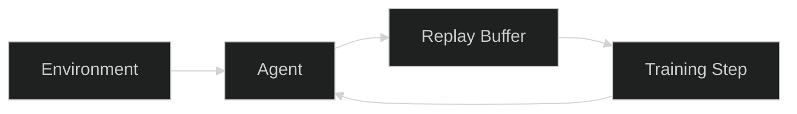

# Documentation Standards

All files under `docs/` and `notes/` follow these conventions so
documentation reads consistently across the project. When adding or
editing docs, match these patterns rather than inventing new ones.

For development setup and commit conventions, see
[Contributing Guide](../../CONTRIBUTING.md).

<br><br>

## Voice and Perspective

Write in **active voice** with **imperative mood** for instructions:

```text
Good:  "Run the training script with the augmentation flag enabled."
Bad:   "The training script should be run with augmentation enabled."
```

Address the reader as **"you"**. Avoid first-person collective ("we
recommend"):

```text
Good:  "You can configure hyperparameters via YAML config files."
Bad:   "We provide configurable hyperparameters in YAML files."
```

<br><br>

## Specificity

Prefer concrete metrics over vague qualifiers:

```text
Good:  "Reduces training time from 4h to 1.5h per game (62% improvement)"
Bad:   "Significantly improves training speed"
```

Avoid: "very", "really", "quite", "fairly", "easily", "simply",
"just", "significantly" (without data).

<br><br>

## Formatting

**Heading hierarchy:** Follow `#` -> `##` -> `###` -> `####` strictly.
Never skip a level. Only one `#` (H1) per document.

**Section spacing:** Use `<br><br>` between major sections (H2-level
blocks). Do not use horizontal rules (`---`) for visual separation.

**Code blocks:** Always include a language tag. Never use bare
(untagged) fenced blocks.

````text
```bash
pytest tests/ -x
```

```python
agent = DQNAgent(config)
state = env.reset()
```

```yaml
training:
  num_steps: 100000
  batch_size: 32
```

```json
{
  "game": "Breakout",
  "score": 45.2
}
```
````

Supported tags: `bash`, `python`, `yaml`, `json`, `toml`, `csv`,
`text`, `markdown`, `mermaid`, `latex`.

**Inline code:** Use backticks for all technical references:

- Class names: `DQNAgent`, `ReplayBuffer`, `AtariWrapper`
- Method names: `select_action()`, `train_step()`, `evaluate()`
- File paths: `docs/vision.md`, `experiments/dqn_atari/configs/`
- Environment variables: `WANDB_API_KEY`, `CUDA_VISIBLE_DEVICES`
- CLI flags and commands: `--num-steps`, `pytest tests/ -x`
- Literal values: `True`, `None`, `0.001`, `"breakout"`
- Config keys: `learning_rate`, `replay_capacity`, `target_update_freq`

<br><br>

## Visual Aids

**Mermaid diagrams** -- use for architecture, flows, and pipelines:

````text
<div align="center">



</div>

**Figure 1:** Brief description of what the diagram shows.
````

Rules:

- Always include `%%{init: {'theme':'dark'}}%%` as the first line
- Wrap in `<div align="center">` for centering
- Add a numbered `**Figure N:**` caption immediately after the closing
  `</div>`

**Tables** -- use for comparing options, listing configuration, or
showing structured data:

```text
| Hyperparameter | Default | Description |
|----------------|---------|-------------|
| `learning_rate` | `0.0001` | Adam optimizer learning rate |
| `replay_capacity` | `100000` | Maximum transitions in replay buffer |
| `target_update_freq` | `1000` | Steps between target network syncs |
```

Backtick all property names, values, and code references within table
cells.

<br><br>

## Cross-References

Use relative markdown links with descriptive text:

```text
See [Vision Doc](../vision.md) for research scope and boundaries.
```

For longer docs, include a quick-links blockquote near the top:

```text
> **Quick links:** [Vision](../vision.md) · [Config Reference](config-cli.md) · [Training Loop](training-loop-runtime.md)
```

Separate links with ` . ` (center dot). Bold the current page's link
when it appears in a quick-links list.

<br><br>

## File Naming

All documentation filenames use **lowercase-hyphen** (kebab-case):

```text
Good:  training-loop-runtime.md, plan-ablations.md, dqn-model.md
Bad:   TrainingLoop.md, plan_ablations.md, DQN-Model.md
```

<br><br>

[Back to Contributing Guide](../../CONTRIBUTING.md)
